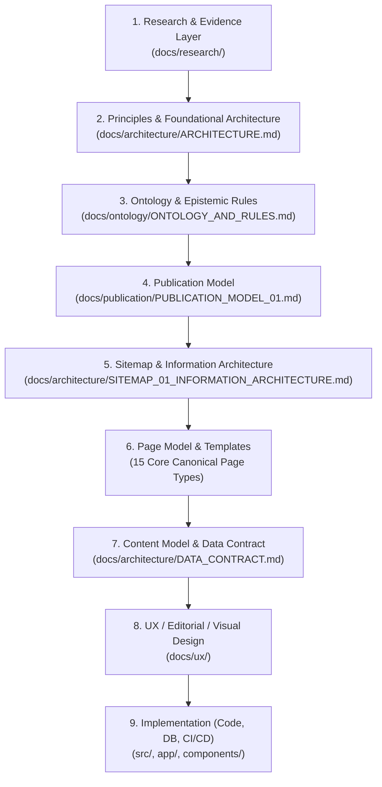

# HỆ THỐNG TÀI LIỆU KIẾN TRÚC & XUẤT BẢN
## DỰ ÁN CÂY GIA PHẢ / GIÒNG HỌ TRẦN TRỌNG THU

> **Bản quyền & Quản trị**: Giòng họ Trần Trọng Thu — Khởi xướng & Quản trị tri thức: Trần Trọng Tuấn  
> **Trạng thái**: Canonical Architecture Index (v1.0 Baseline)  
> **Cập nhật lần cuối**: 2026-09-05  

---

## 1. TỔNG QUAN DỰ ÁN & TRIẾT LÝ NỀN TẢNG

Dự án **Cây Gia Phả / Giòng họ Trần Trọng Thu** là một hệ sinh thái tri thức số hoá, phụng sự việc sưu tầm, bảo tồn, hệ thống hoá và trao truyền di sản của một giòng họ thực tế bắt đầu từ con số không — nơi tư liệu phân mảnh, ký ức mai một dần theo thời gian, và động lực xuất phát từ một cá nhân khởi xướng mong muốn lưu giữ cội nguồn cho các thế hệ tương lai.

### Nguyên tắc cốt lõi bất khả xâm phạm:
1. **"Giữ lại trước khi diễn giải"**: Phân định ranh giới tuyệt đối giữa *Dữ liệu thực thể khách quan (Entity)*, *Tư liệu bằng chứng gốc (Archive Record)* và *Bài viết / Diễn giải chủ quan (Editorial Article)*.
2. **Minh bạch nhận thức (Epistemic Certainty Discipline)**: Mọi thông tin, tri thức đều phải được gắn nhãn độ tin cậy (`CONFIRMED`, `ORAL_TRADITION`, `MEMORY`, `INTERPRETATION`, `UNVERIFIED`, `DISPUTED`, `UNKNOWN`). Không bao giờ biến giả thuyết hoặc ký ức chưa đối soát thành sự thật gia phả định danh.
3. **Một hệ thống xuất bản thống nhất (Unified Publication System)**: Hệ thống là **MỘT** Publication hoàn chỉnh bao gồm 3 Lãnh thổ Xuất bản (*Gia Phả*, *Mạch*, *Tư Liệu*) vận hành trên một lõi tri thức thống nhất (*Knowledge Graph & Data Layer*). Lịch dòng họ (Calendar) và Tìm kiếm toàn cục (Search) là *Năng lực hệ thống (Capabilities)*, không phải thương hiệu độc lập.

---

## 2. PHÂN TẦNG TÀI LIỆU (DOCUMENTATION PIPELINE HIERARCHY)

Tất cả các tài liệu kỹ thuật, kiến trúc và hướng dẫn thiết kế được tổ chức theo quy trình từ trừu tượng nhận thức đến triển khai vật lý:

---

## 3. DANH MỤC TÀI LIỆU CHUẨN (CANONICAL SOURCE OF TRUTH MAP)

### 🏛️ BẬC 1: KIẾN TRÚC & NỀN TẢNG CHUẨN (CANONICAL CORE)

Các tài liệu dưới đây là **Source of Truth** cao nhất của hệ thống. Mọi tài liệu thiết kế UX hoặc dòng mã triển khai (code) đều phải tuân thủ nghiêm ngặt các định nghĩa tại đây:

| Đường dẫn tài liệu | Phân tầng | Trạng thái | Mô tả & Phạm vi |
| :--- | :--- | :--- | :--- |
| [`docs/architecture/ARCHITECTURE.md`](file:///Users/tuantq/Projects/Personal/family-calendar/docs/architecture/ARCHITECTURE.md) | Architecture | **Canonical** (v1.0) | Hiến chương kiến trúc tổng thể, mô hình 3 tầng (Data/Knowledge/Publication), nguyên tắc bất biến, chu kỳ nội dung, vai trò và bảo tồn dữ liệu. |
| [`docs/ontology/ONTOLOGY_AND_RULES.md`](file:///Users/tuantq/Projects/Personal/family-calendar/docs/ontology/ONTOLOGY_AND_RULES.md) | Ontology | **Canonical** (v1.0) | Bản đồ Ontology, phân loại 5 nhóm thực thể/khái niệm, 7 cấp độ Epistemic Certainty, hệ thống quan hệ thực thể, quy tắc suy luận tri thức. |
| [`docs/publication/PUBLICATION_MODEL_01.md`](file:///Users/tuantq/Projects/Personal/family-calendar/docs/publication/PUBLICATION_MODEL_01.md) | Publication | **Canonical** (v1.0) | Publication Model v1: 3 Lãnh thổ xuất bản (*Gia Phả, Mạch, Tư Liệu*), 15 Core Page Types, Ma trận ánh xạ Ontology ↔ Page, 4 Chế độ đọc. |
| [`docs/architecture/SITEMAP_01_INFORMATION_ARCHITECTURE.md`](file:///Users/tuantq/Projects/Personal/family-calendar/docs/architecture/SITEMAP_01_INFORMATION_ARCHITECTURE.md) | Information Arch | **Canonical** (v2.0) | Cấu trúc URL định danh chuẩn, Kiến trúc thông tin (IA), Điều hướng Top/Contextual/Footer, mô hình Capabilities (Calendar & Search). |
| [`docs/architecture/SITEMAP_vNEXT_PROPOSED_02.md`](file:///Users/tuantq/Projects/Personal/family-calendar/docs/architecture/SITEMAP_vNEXT_PROPOSED_02.md) | Sitemap Refinement | **Proposed (Refinement 02)** | Đặc tả Sitemap vNext chuẩn hóa, tách rõ IA/Sitemap/Nav/Capability, phân định Memory & Tư Liệu, kiểm toán bảo toàn 100% năng lực. |
| [`docs/architecture/DATA_CONTRACT.md`](file:///Users/tuantq/Projects/Personal/family-calendar/docs/architecture/DATA_CONTRACT.md) | Data Contract | **Working Baseline** | Định nghĩa chi tiết JSON schema, schema metadata, quan hệ dữ liệu vật lý. |

---

### 🔬 BẬC 2: NGHIÊN CỨU & BẰNG CHỨNG (RESEARCH LAYER)

Tài liệu ghi nhận khảo sát thực địa, đối chiếu học thuật và phỏng vấn gia đình:

| Đường dẫn tài liệu | Phân tầng | Trạng thái | Mô tả & Phạm vi |
| :--- | :--- | :--- | :--- |
| [`docs/research/family-heritage/FAMILY_HERITAGE_ARCHITECTURE_01 — RESEARCH FINDINGS.md`](file:///Users/tuantq/Projects/Personal/family-calendar/docs/research/family-heritage/FAMILY_HERITAGE_ARCHITECTURE_01%20%E2%80%94%20RESEARCH%20FINDINGS.md) | Research | **Reference** | Nghiên cứu tổng hợp về thể chế gia tộc, phả học Việt Nam, ký ức phân mảnh, khảo sát các nền tảng phả học thế giới. |

---

### 🎨 BẬC 3: THIẾT KẾ UX, BIÊN TẬP & ĐẶC TẢ CHI TIẾT (UX & EDITORIAL SPEC)

Các tài liệu nghiên cứu trải nghiệm, kiểu chữ, benchmark và thiết kế thành phần con (lưu ý: phải luôn đối chiếu với Canonical Core):

| Đường dẫn tài liệu | Phân tầng | Trạng thái | Mô tả & Phạm vi |
| :--- | :--- | :--- | :--- |
| [`docs/ux/PUBLICATION_ARCHITECTURE_01.md`](file:///Users/tuantq/Projects/Personal/family-calendar/docs/ux/PUBLICATION_ARCHITECTURE_01.md) | UX Architecture | **Contextual Spec** | Đặc tả UX xuất bản ban đầu cho phân hệ bài viết MẠCH. |
| [`docs/ux/MACH_FOUNDATION_01_PUBLICATION_ENGINE_SPEC.md`](file:///Users/tuantq/Projects/Personal/family-calendar/docs/ux/MACH_FOUNDATION_01_PUBLICATION_ENGINE_SPEC.md) | Engine Spec | **Contextual Spec** | Đặc tả công cụ xuất bản nội dung Markdown, rendering semantic HTML, footnotes và typography cho MẠCH. |
| [`docs/ux/MACH_FOUNDATION_02_CONTENT_MEDIA_ENGINE.md`](file:///Users/tuantq/Projects/Personal/family-calendar/docs/ux/MACH_FOUNDATION_02_CONTENT_MEDIA_ENGINE.md) | Media Engine | **Contextual Spec** | Đặc tả xử lý hình ảnh, tư liệu đính kèm, lightbox và bảo tồn visual. |
| [`docs/ux/TYPOGRAPHY_02_GLOBAL_READABILITY.md`](file:///Users/tuantq/Projects/Personal/family-calendar/docs/ux/TYPOGRAPHY_02_GLOBAL_READABILITY.md) | Typography | **Design Guideline** | Quy chuẩn hệ thống typography, tỷ lệ font, khoảng cách dòng phục vụ trải nghiệm đọc dài. |
| [`docs/ux/ARCH_03_FAMILY_GRAPH.md`](file:///Users/tuantq/Projects/Personal/family-calendar/docs/ux/ARCH_03_FAMILY_GRAPH.md) | Visual Graph | **UX Research** | Thiết kế tương tác cây gia phả, sơ đồ phả hệ trực quan (Lineage Graph UX). |

---

## 4. HƯỚNG DẪN ĐỌC THEO VAI TRÒ (READING GUIDE BY PERSONA)

### 🧑‍💻 Dành cho Kỹ sư Phát triển (Frontend / Fullstack Developer)
1. Bắt đầu từ [`docs/architecture/ARCHITECTURE.md`](file:///Users/tuantq/Projects/Personal/family-calendar/docs/architecture/ARCHITECTURE.md) để hiểu bức tranh 3 tầng (Data - Knowledge - Publication) và nguyên tắc phân tách.
2. Đọc [`docs/architecture/SITEMAP_01_INFORMATION_ARCHITECTURE.md`](file:///Users/tuantq/Projects/Personal/family-calendar/docs/architecture/SITEMAP_01_INFORMATION_ARCHITECTURE.md) và [`docs/publication/PUBLICATION_MODEL_01.md`](file:///Users/tuantq/Projects/Personal/family-calendar/docs/publication/PUBLICATION_MODEL_01.md) để nắm rõ cấu trúc định tuyến (URL route), 15 loại trang (Page Types), và quan hệ liên kết chéo.
3. Đọc [`docs/ontology/ONTOLOGY_AND_RULES.md`](file:///Users/tuantq/Projects/Personal/family-calendar/docs/ontology/ONTOLOGY_AND_RULES.md) và [`docs/architecture/DATA_CONTRACT.md`](file:///Users/tuantq/Projects/Personal/family-calendar/docs/architecture/DATA_CONTRACT.md) để nắm schema kiểu dữ liệu và thuộc tính Epistemic Certainty.
4. Đọc [`docs/ux/MACH_FOUNDATION_01_PUBLICATION_ENGINE_SPEC.md`](file:///Users/tuantq/Projects/Personal/family-calendar/docs/ux/MACH_FOUNDATION_01_PUBLICATION_ENGINE_SPEC.md) để nắm quy tắc bắt buộc render semantic Markdown (không hiển thị raw syntax).

### ✍️ Dành cho Người biên tập & Người quản trị tri thức (Editor / Steward)
1. Đọc [`docs/architecture/ARCHITECTURE.md`](file:///Users/tuantq/Projects/Personal/family-calendar/docs/architecture/ARCHITECTURE.md) (Mục 1 & Mục 3: Nguyên tắc bất biến và Chu kỳ nội dung).
2. Đọc [`docs/publication/PUBLICATION_MODEL_01.md`](file:///Users/tuantq/Projects/Personal/family-calendar/docs/publication/PUBLICATION_MODEL_01.md) để phân biệt ranh giới giữa 3 Lãnh thổ: *Gia Phả* (thông tin nhân vật), *Mạch* (bài viết/ký sự), và *Tư Liệu* (hiện vật/chứng cứ).
3. Đọc [`docs/ontology/ONTOLOGY_AND_RULES.md`](file:///Users/tuantq/Projects/Personal/family-calendar/docs/ontology/ONTOLOGY_AND_RULES.md) (Mục 3: Epistemic Certainty) để biết cách gắn nhãn mức độ xác thực cho từng mẩu ký ức và thông tin truyền khẩu.

### 🎨 Dành cho Nhà thiết kế Trải nghiệm & Giao diện (UX / UI Designer)
1. Đọc [`docs/publication/PUBLICATION_MODEL_01.md`](file:///Users/tuantq/Projects/Personal/family-calendar/docs/publication/PUBLICATION_MODEL_01.md) (Mục 4: 15 Core Page Types & Mục 6: 4 Chế độ đọc) để nắm tinh thần trang nhã, tôn nghiêm, giàu chất văn hoá của từng loại trang.
2. Đọc [`docs/architecture/SITEMAP_01_INFORMATION_ARCHITECTURE.md`](file:///Users/tuantq/Projects/Personal/family-calendar/docs/architecture/SITEMAP_01_INFORMATION_ARCHITECTURE.md) để thiết kế hệ thống Header, Nav, Drawer, Bottom Bar và Universal Search/Calendar.
3. Đọc [`docs/ux/TYPOGRAPHY_02_GLOBAL_READABILITY.md`](file:///Users/tuantq/Projects/Personal/family-calendar/docs/ux/TYPOGRAPHY_02_GLOBAL_READABILITY.md) và [`docs/ux/MACH_FOUNDATION_01_PUBLICATION_ENGINE_SPEC.md`](file:///Users/tuantq/Projects/Personal/family-calendar/docs/ux/MACH_FOUNDATION_01_PUBLICATION_ENGINE_SPEC.md) để áp dụng quy chuẩn chữ và nhịp điệu dàn trang (editorial rhythm).

---

## 5. NGUYÊN TẮC THAY ĐỔI KIẾN TRÚC (ARCHITECTURE CHANGE PROTOCOL)

Nhằm đảm bảo tính toàn vẹn và nhất quán của hệ thống tri thức gia phả qua nhiều năm tháng, bất kỳ thay đổi nào cũng phải tuân thủ nghiêm ngặt quy trình:

1. **Khảo sát & Đối chiếu (Research & Evidence First)**: Mọi đề xuất thay đổi mô hình dữ liệu hoặc cấu trúc xuất bản phải có lý do dựa trên thực chứng tư liệu hoặc yêu cầu bảo tồn di sản, không dựa trên cảm tính ngẫu hứng.
2. **Cập nhật Top-Down**: Khi thay đổi một khái niệm cốt lõi:
   - Cập nhật **Ontology** (`docs/ontology/ONTOLOGY_AND_RULES.md`) trước.
   - Cập nhật **Publication Model** (`docs/publication/PUBLICATION_MODEL_01.md`) và **Sitemap** (`docs/architecture/SITEMAP_01_INFORMATION_ARCHITECTURE.md`).
   - Cập nhật **Data Contract** (`docs/architecture/DATA_CONTRACT.md`).
   - Sau cùng mới tiến hành sửa đổi mã nguồn (code) hoặc giao diện (UI).
3. **Bảo tồn tính tương thích ngược**: Không xoá bỏ các định danh (slug / ID / route) của nhân vật hay tư liệu lịch sử. Mọi chỉnh sửa nội dung phả ký đều phải lưu vết lịch sử (versioning / provenance).
