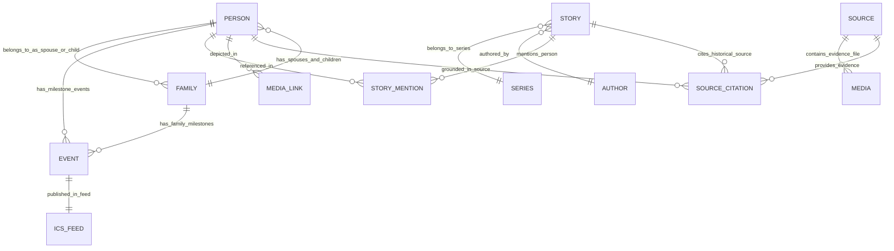

# KIẾN TRÚC THÔNG TIN & SITEMAP ĐỀ XUẤT: CÂY GIA PHẢ
## HỆ THỐNG TRI THỨC DÒNG HỌ TRẦN TRỌNG THU (`family-calendar`)
### STATUS: PROPOSED INFORMATION ARCHITECTURE — PENDING REVIEW
*Tài liệu Đề xuất Kiến trúc Thông tin (Proposed IA Document — Chưa phê duyệt)*  
*Ngày cập nhật: 05/09/2026*  
*Workspace: `/Users/tuantq/Projects/Personal/family-calendar`*  

---

## 1. TỔNG QUAN ĐIỀU HÀNH (EXECUTIVE SUMMARY)

Hệ thống thông tin `family-calendar` ban đầu được xây dựng như một tiện ích đồng bộ lịch gia đình 4 feeds iCalendar kết hợp trích xuất sơ lược phả hệ từ file GEDCOM nguồn (`GIADINHONGTHU.ged`). Qua các giai đoạn phát triển (ARCH_01 đến ARCH_03D), hệ thống đã mở rộng thêm Sơ đồ phả hệ (Family Graph), Danh bạ cá nhân (People), Danh sách gia đình (Families), Dòng thời gian (Timeline) và Ký ức (Memories).

Tuy nhiên, cấu trúc điều hướng hiện hữu trong mã nguồn mang tính **phẳng và phân mảnh (flat navigation 7 tabs ngang hàng)**, gây nhập nhằng giữa:
* Mô hình thông tin (Information Model) và Khung hiển thị / Tương tác UI (Modals, Drawers, Floating Toolbars).
* Dữ liệu phả hệ cấu trúc khách quan (Canonical Genealogy Data) và Không gian tự sự / Kỷ yếu dòng họ (Editorial Narratives).
* Các phương thức chiếu dữ liệu khác nhau của cùng một miền tri thức (Cây, Người, Nhà, Quan hệ).

Tài liệu này đệ trình **Đề xuất Kiến trúc Thông tin Chuẩn hóa (Proposed Information Architecture)** nhằm:
1. Xác lập **4 Không Gian Tri Thức Cốt Lõi (4 Core Knowledge Spaces)**: `🌳 GIA PHẢ`, `🧵 MẠCH`, `📅 LỊCH`, `📚 TƯ LIỆU`, bên cạnh **Trang Chủ (Home)** đóng vai trò Cổng tổng quan định hướng (Gateway / Portal).
2. Tách bạch hoàn toàn ranh giới giữa **Taxonomy / Sitemap** (cấu trúc thông tin) và **UI Architecture / Component Mechanics** (ngăn kéo, hộp thoại, thanh trượt).
3. Định vị chuẩn xác không gian `🧵 MẠCH` là cơ quan tự sự / kỷ yếu chung của đại tộc với mô hình Đa tác giả (Multi-author), trong đó Series *"Thư gửi Clara"* là một tác phẩm tiêu biểu do Tuấn TQ chấp bút.
4. Chuẩn hóa mô hình liên kết ngữ cảnh đa chiều (Cross-navigation) và phân định 4 tầng ranh giới dữ liệu (Canonical, Derived, Editorial, Archival Source).

---

## 2. AUDIT HIỆN TRẠNG KIẾN TRÚC THÔNG TIN (CURRENT IA AUDIT)

### 2.1. Hiện trạng Điều hướng & Tuyến đường trong Code (`src/js/app.js` & `index.html`)

Trong mã nguồn hiện tại, thanh điều hướng chính (`#mainNav`) bố trí 7 mục ngang hàng cùng 2 modal nổi:

```text
CURRENT FLAT ROUTING (7 Top-Level Tabs + 2 Inset Modals):
├── #/ (view_home)                 ── Hero banner, 4 stats cards, 4 quick nav cards
├── #/calendar (view_calendar)     ── Month grid (overflow scroll), Agenda view, 4 Layer chips, Drawer
├── #/tree (view_tree)             ── Family Graph (Focus canvas / Explore bands), Legend, Breadcrumb
├── #/people (view_people)         ── Flat grid 223 person cards, Search filter input
├── #/families (view_families)     ── Grid 68 family cards, F0–F4 generation filter pills
├── #/timeline (view_timeline)     ── Vertical event timeline (births, deaths, marriages)
├── #/memories (view_memories)     ── 2 memory narrative cards (Cụ Thu & Cụ Xuân)
├── #/person/:id                   ── Inset detail modal / profile view
└── #/family/:id                   ── Inset detail modal / family unit view
```

### 2.2. Bảng Phân Tích & Đánh Giá Hiện Trạng

| Tên View / Route | ID DOM Container | Loại View | Cơ Chế Dữ Liệu | Đánh Giá Kiến Trúc Hiện Trạng |
| :--- | :--- | :--- | :--- | :--- |
| **Tổng quan (`#/`)** | `view_home` | Page Dashboard | Static counts & Links | Tốt vai trò Cổng nhập đề, nhưng các thẻ điều hướng còn trỏ về 7 tab phẳng. |
| **Lịch Gia Đình (`#/calendar`)** | `view_calendar` | Temporal App | 4 ICS Feeds (Client-parsed) | Hoạt động tốt, nhưng Month View và Agenda View đang xếp chồng dọc thay vì chuyển đổi chế độ. |
| **Cây Gia Phả (`#/tree`)** | `view_tree` | Interactive Graph | BFS Graph Derivation (F0–F4) | Trực quan hóa quan hệ tốt; Focus Mode và Explore Mode là View Modes nhưng nằm chung trong trang. |
| **Thành viên (`#/people`)** | `view_people` | Directory Grid | Filter từ `genealogy.json` | Thực chất là một Projection dạng bảng/danh bạ của Không gian Gia Phả. |
| **Gia đình (`#/families`)** | `view_families` | Directory Grid | Derived Family Generations | Thực chất là một Projection dạng nhóm gia đình của Không gian Gia Phả. |
| **Dòng thời gian (`#/timeline`)**| `view_timeline` | Linear Feed | Mốc năm tăng dần | Trùng lặp một phần với Lịch và Phả hệ; nên là công cụ phân tích thời gian trong Gia Phả. |
| **Ký ức & Tư liệu (`#/memories`)**| `view_memories` | Editorial List | Hardcoded array trong JSON | Bị lẫn lộn giữa bài viết cảm xúc (Stories) và tư liệu chứng minh (Sources). |
| **Person Detail (`#/person/:id`)**| `view_person` | Modal Inset | Lookup facts theo PID | Là cơ chế hiển thị chi tiết thực thể (Entity Detail), không phải một không gian độc lập. |
| **Family Detail (`#/family/:id`)**| `view_family` | Modal Inset | Lookup facts theo FID | Là cơ chế hiển thị chi tiết thực thể (Entity Detail), không phải một không gian độc lập. |

---

## 3. RANH GIỚI GIỮA KIẾN TRÚC THÔNG TIN VÀ KIẾN TRÚC GIAO DIỆN (IA VS UI ARCHITECTURE BOUNDARY)

Để khắc phục hiện tượng nhập nhằng trong các bản thảo trước, bảng quy chuẩn sau phân định nghiêm ngặt các cấp độ:

```text
┌────────────────────────────────────────────────────────────────────────────────────────┐
│ 1. SITEMAP SPACES & SECTIONS (Cấu Trúc Cây Thông Tin - Taxonomy)                       │
│    • Định nghĩa: Dữ liệu gì tồn tại, thuộc miền tri thức nào, tổ chức phân cấp ra sao.  │
│    • Ví dụ: GIA PHẢ, MẠCH, LỊCH, TƯ LIỆU, Series "Thư gửi Clara".                      │
├────────────────────────────────────────────────────────────────────────────────────────┤
│ 2. NAVIGATION HIERARCHY (Hệ Thống Điều Hướng Đa Tầng)                                  │
│    • Định nghĩa: Đường đi (Wayfinding) giúp người dùng di chuyển giữa các không gian.   │
│    • Ví dụ: Top-Level Navbar, Sub-tabs (Cây/Người/Nhà), Breadcrumb trực hệ.             │
├────────────────────────────────────────────────────────────────────────────────────────┤
│ 3. ROUTE TAXONOMY (Địa Chỉ Tuyến Đường URL)                                            │
│    • Định nghĩa: Định danh tài nguyên duy nhất trên thanh địa chỉ trình duyệt.           │
│    • Ví dụ: #/tree, #/people, #/mach/series/thu-gui-clara, #/person/G5X4-48S.          │
├────────────────────────────────────────────────────────────────────────────────────────┤
│ 4. VIEWS & PROJECTIONS (Các Cách Chiếu / Góc Nhìn Dữ Liệu)                             │
│    • Định nghĩa: Cách hiển thị tập dữ liệu cho một mục đích trải nghiệm cụ thể.        │
│    • Ví dụ: Cây đồ họa (Graph View) vs Danh bạ (Directory View) trong Gia Phả;        │
│             Lưới Tháng (Month Grid) vs Sổ Sự Kiện (Agenda) trong Lịch.                 │
├────────────────────────────────────────────────────────────────────────────────────────┤
│ 5. CONTEXTUAL CAPABILITIES & TOOLS (Công Cụ Ngữ Cảnh)                                  │
│    • Định nghĩa: Tính năng tính toán / lọc / tìm kiếm tại chỗ trên dữ liệu.             │
│    • Ví dụ: Relationship Finder (Tính quan hệ họ hàng), Layer Filters (4 lớp Lịch).    │
├────────────────────────────────────────────────────────────────────────────────────────┤
│ 6. UI COMPONENTS & INTERACTION MECHANICS (Thành Phần Giao Diện & Cơ Chế Tương Tác)    │
│    • Định nghĩa: Vỏ bọc hiển thị tạm thời hoặc tương tác cục bộ (KHÔNG PHẢI SITEMAP). │
│    • Ví dụ: Day Detail Drawer, Person Modal, Floating Toolbar, Zoom/Pan Canvas.        │
└────────────────────────────────────────────────────────────────────────────────────────┘
```

---

## 4. KẾT QUẢ KHẢO SÁT BENCHMARK ĐA NGUỒN (BENCHMARK FINDINGS)

```text
┌─────────────────┬──────────────────────────────────┬────────────────────────────────────────────────────────┐
│ Nguồn Benchmark │ Đặc Điểm Tổ Chức Không Gian      │ Bài Học Áp Dụng Cho Dòng Họ Trần Trọng Thu             │
├─────────────────┼──────────────────────────────────┼────────────────────────────────────────────────────────┤
│ **Gramps Web**  │ Chia 3 trụ: People, Families,    │ Menu chính tối giản; Cây, Danh bạ và Sự kiện là        │
│                 │ Events. Cây là view mode.        │ các View Projections bên trong miền Genealogy.         │
├─────────────────┼──────────────────────────────────┼────────────────────────────────────────────────────────┤
│ **webtrees**    │ Phân biệt chặt chẽ: Indi, Fam,   │ Tách bạch tuyệt đối giữa Fact gia phả và Source/Media; │
│                 │ Source, Repository, Story.       │ Cho phép liên kết 1 Story tới nhiều Person.            │
├─────────────────┼──────────────────────────────────┼────────────────────────────────────────────────────────┤
│ **MyHeritage**  │ Family Tree, Discoveries,        │ Không gian Kỷ yếu/Câu chuyện tách biệt khỏi Cây;       │
│                 │ Photos, DNA. Rất giàu cảm xúc.   │ Thẻ người luôn có avatar và tiểu sử tóm tắt.           │
├─────────────────┼──────────────────────────────────┼────────────────────────────────────────────────────────┤
│ **Reference App**│ 5 Không gian: Sơ đồ, Kỷ yếu,    │ Cây phả hệ có Side Inspector Drawer; Thẻ Giỗ Chạp     │
│ (Gia Phả Việt)  │ Giỗ chạp, Tìm kiếm, Cá nhân hóa. │ có huy hiệu Âm lịch (🌙) và vai trò chủ tế.           │
├─────────────────┼──────────────────────────────────┼────────────────────────────────────────────────────────┤
│ **Nexus Hub**   │ Editorial / Archival document    │ Bố cục trang bìa Kỷ yếu sang trọng, phông Serif cổ     │
│ (Base44)        │ typography, warm ivory canvas.   │ kính, khoảng cách lề rộng rãi, tôn nghiêm.             │
└─────────────────┴──────────────────────────────────┴────────────────────────────────────────────────────────┘
```

---

## 5. MÔ HÌNH SẢN PHẨM ĐỀ XUẤT: 4 KHÔNG GIAN + CỔNG TỔNG QUAN

Sản phẩm được định hình thành **1 Cổng Tổng Quan (Portal/Gateway)** và **4 Không Gian Tri Thức Cốt Lõi (4 Core Knowledge Spaces)**:

```text
                               ┌─────────────────────────────────────────┐
                               │         DÒNG HỌ TRẦN TRỌNG THU          │
                               │           0.0 TRANG CHỦ (Home)          │
                               │   (Cổng Định Hướng, Nhập Đề & Tổng Hợp)  │
                               └────────────────────┬────────────────────┘
                                                    │
        ┌───────────────────────────┬───────────────┴───────────┬───────────────────────────┐
        │                           │                           │                           │
┌───────┴───────────────┐   ┌───────┴───────────────┐   ┌───────┴───────────────┐   ┌───────┴───────────────┐
│      🌳 GIA PHẢ       │   │        🧵 MẠCH        │   │        📅 LỊCH        │   │      📚 TƯ LIỆU       │
│  (Genealogy Domain)   │   │  (Clan Narratives)    │   │  (Temporal Rhythms)   │   │  (Archival Evidence)  │
├───────────────────────┤   ├───────────────────────┤   ├───────────────────────┤   ├───────────────────────┤
│ • Cây phả hệ đồ họa   │   │ • Tuyển tập / Series  │   │ • Lịch tổng hợp 4 lớp │   │ • Văn bản Hán Nôm     │
│ • Danh bạ 223 cá nhân │   │ • Ký ức / Giai thoại  │   │ • Sổ Lễ Giỗ Âm lịch   │   │ • Sổ Rửa tội Bùi Chu  │
│ • Danh sách 68 nhà    │   │ • Chủ đề tộc ước      │   │ • Lễ Kính Bổn mạng    │   │ • Thư viện ảnh cổ     │
│ • Tra cứu quan hệ     │   │ • Tác giả chấp bút    │   │ • Đăng ký 4 Feeds ICS │   │ • Nguồn gốc GEDCOM    │
└───────────────────────┘   └───────────────────────┘   └───────────────────────┘   └───────────────────────┘
```

* **Trang Chủ (Home)**: Không phải là một không gian tri thức thứ 5 chứa dữ liệu riêng biệt, mà là một **Dashboard / Portal Gateway** giúp định vị di sản, tổng kết số liệu cốt lõi, và dẫn hướng nhanh vào 4 không gian chính.

---

## 6. SITEMAP TỔNG THỂ ĐỀ XUẤT (PROPOSED SITEMAP)

```text
SITEMAP — DÒNG HỌ TRẦN TRỌNG THU
│
├── 0.0 TRANG CHỦ (Home / Portal Gateway)
│   ├── 0.1 Hero Di Sản & Thông Tin Tộc Ước Khởi Thủy
│   ├── 0.2 Bảng Thống Kê Dữ Liệu Cốt Lõi (223 thành viên, 68 gia đình, 4 thế hệ F0–F4)
│   ├── 0.3 Tiêu Điểm Sự Kiện & Lễ Giỗ Sắp Tới (Next Upcoming Observances)
│   ├── 0.4 Bài Tự Sự Mới Nhất Từ MẠCH
│   └── 0.5 Lối Vào 4 Không Gian Tri Thức
│
├── 1.0 🌳 GIA PHẢ (Genealogy Domain)
│   ├── 1.1 Cây Gia Phả (Family Graph — Primary Interactive View)
│   ├── 1.2 Danh Bạ Thành Viên (People Directory — Tabular & Card View)
│   ├── 1.3 Danh Sách Gia Đình (Families Directory — Grouped Generation View)
│   ├── 1.4 Công Cụ Tra Cứu Quan Hệ (Relationship & Kinship Finder)
│   ├── 1.5 Dòng Thời Gian Phả Hệ (Chronological Lineage Timeline)
│   └── 1.6 Chi Tiết Thực Thể (Entity Detail Routes)
│       ├── Hồ Sơ Cá Nhân Chi Tiết (`/person/:id`)
│       └── Hồ Sơ Gia Đình Hạt Nhân (`/family/:id`)
│
├── 2.0 🧵 MẠCH (Clan Narratives & Editorial Domain)
│   ├── 2.1 Trang Mục Lục Tự Sự (Clan Editorial Index)
│   ├── 2.2 Tuyển Tập & Series Dòng Họ (Clan Collections & Series)
│   │   ├── Series Tiêu Điểm: "Thư gửi Clara" (Tác giả: Tuấn TQ)
│   │   ├── Series: "Cội Nguồn Thọ Vực — Bùi Chu"
│   │   └── Series: "Hành Trình Nam Tiến 1954"
│   ├── 2.3 Bài Viết & Ký Ức Độc Lập (Individual Stories & Memories)
│   ├── 2.4 Chủ Đề & Chuyên Mục (Topics Taxonomy: #GiaPhong, #HocVan, #DiCu1954...)
│   ├── 2.5 Danh Mục Tác Giả & Nhân Chứng (Authors & Historical Contributors)
│   └── 2.6 Chi Tiết Bài Đọc / Tuyển Tập
│       ├── Trang Đọc Tuyển Tập (`/mach/series/:slug`)
│       └── Trang Đọc Bài Viết (`/mach/story/:id`)
│
├── 3.0 📅 LỊCH (Calendar & Observances Domain)
│   ├── 3.1 Lịch Tổng Hợp Đa Lớp (Master Calendar Application)
│   ├── 3.2 Sổ Lễ Giỗ & Tưởng Niệm (Memorial & Ancestor Feast Observances)
│   ├── 3.3 Lịch Kính Thánh Bổn Mạng (Patron Feast Observances)
│   ├── 3.4 Kênh Đăng Ký Lịch (Calendar Feeds Subscription Center — 4 ICS)
│   └── 3.5 Chi Tiết Ngày Sự Kiện (Day Detail — Projected via Drawer / Route)
│
└── 4.0 📚 TƯ LIỆU (Archival Sources & Evidence Vault)
    ├── 4.1 Danh Mục Văn Bản Lịch Sử (Historical Document Vault)
    ├── 4.2 Thư Viện Hình Ảnh Di Sản (Heritage Photo Archive)
    ├── 4.3 Nguồn Gốc Dữ Liệu & Kiểm Định (Data Provenance & Integrity Gate Reports)
    └── 4.4 Chi Tiết Tài Liệu / Hiện Vật (`/archives/doc/:id` & `/archives/media/:id`)
```

---

## 7. PHÂN CẤP ĐIỀU HƯỚNG CHI TIẾT (NAVIGATION HIERARCHY)

Để giải quyết dứt điểm tình trạng quá tải điều hướng, hệ thống phân chia luồng tương tác thành 6 cấp độ rành mạch:

```text
CẤP 1: TOP-LEVEL NAVIGATION (Global Navbar Cố Định)
├── [Ấn Triện / Logo Dòng Họ] ── Trỏ về Trang Chủ (#/)
├── [Thanh Tìm Kiếm Toàn Cục] ── Universal Federated Search Modal
└── 4 Nút Điều Hướng Phân Hệ Chính (Primary Navigation Pills):
    ├── 🌳 GIA PHẢ  (Route: #/tree hoặc #/genealogy)
    ├── 🧵 MẠCH     (Route: #/mach)
    ├── 📅 LỊCH     (Route: #/calendar)
    └── 📚 TƯ LIỆU  (Route: #/archives)

CẤP 2: SECTION CONTROLS (Thanh Điều Hướng Phân Hệ / Sub-tabs)
├── Trong GIA PHẢ: [🌳 Cây Phả Hệ] | [👤 Thành Viên] | [👨‍👩‍👧 Gia Đình] | [🔗 Quan Hệ]
├── Trong MẠCH:    [Bài Viết Mới] | [📚 Tuyển Tập / Series] | [🏷️ Chủ Đề] | [✍️ Tác Giả]
├── Trong LỊCH:    [🗓️ Lưới Tháng] | [📋 Sổ Sự Kiện (Agenda)] | [📥 Đăng Ký Feeds]
└── Trong TƯ LIỆU: [📜 Văn Bản Hán Nôm/Hộ Tịch] | [🖼️ Ảnh Di Sản] | [⚙️ Nguồn GEDCOM]

CẤP 3: VIEW MODES & FILTERS (Chế Độ Hiển Thị & Bộ Lọc Nội Tại)
├── Trong Cây Phả Hệ: [Chế độ Phả Đồ Trực Hệ (Focus)] vs [Chế độ Toàn Cảnh Thế Hệ (Explore Bands)]
├── Trong Danh Bạ Gia Đình: Bộ lọc Pills Thế Hệ [Tất cả | F0 | F1 | F2 | F3 | F4]
└── Trong Lịch: 4 Hộp kiểm Bật/Tắt Lớp Sự Kiện (🎂 Sinh nhật | ✝️ Bổn mạng | 🕯️ Ngày giỗ | 📅 Sự kiện)

CẤP 4: CONTEXTUAL NAVIGATION (Điều Hướng Ngữ Cảnh Tức Thời Giữa Các Miền)
├── Từ Danh bạ Thành viên ──> Bấm "Xem trên Cây" ──> Nhảy vào Graph, Focus vào Person Node
├── Từ Thẻ Sự Kiện Giỗ   ──> Bấm Tên Nhân Vật   ──> Mở Hồ Sơ Cá Nhân / Focus trên Cây
└── Từ Bài Viết Kỷ Yếu   ──> Bấm Tag Nhân Vật   ──> Mở Hồ Sơ Cá Nhân / Đọc tài liệu liên quan

CẤP 5: CONTEXTUAL DRAWERS & BOTTOM SHEETS (Ngăn Trượt Kiểm Tra Nhanh - Không Rời Màn Hình)
├── Side Inspector Panel (Desktop): Trượt ra từ cạnh phải khi click Person Node trên Cây
└── Day Detail Drawer (Mobile/Desktop): Trượt lên khi click vào ô ngày trên Lưới Lịch

CẤP 6: DEDICATED DETAIL ROUTES (Trang Chi Tiết Thực Thể Độc Lập)
├── Hồ Sơ Cá Nhân Toàn Phần (`#/person/:id`)
├── Hồ Sơ Gia Đình Hạt Nhân (`#/family/:id`)
├── Trang Đọc Bài Viết / Series (`#/mach/story/:id` & `#/mach/series/:slug`)
└── Trang Xem Tư Liệu / Hiện Vật (`#/archives/doc/:id`)
```

---

## 8. BẢN ĐỒ TUYẾN ĐƯỜNG CHUẨN HÓA (ROUTE MAP)

Hệ thống duy trì cơ chế Client-side Hash Routing (`#/`) chuẩn SEO tĩnh, hoàn toàn tương thích với Vercel và GitHub Pages:

| Tuyến Đường (Route Pattern) | Không Gian Trọng Tâm | Tên View Component | Tham Số Truy Vấn (Query Params) & Vai Trò |
| :--- | :--- | :--- | :--- |
| `#/` | **Home** | `HomePortalView` | Cổng thông tin tổng quan, định hướng di sản |
| `#/tree` | **Gia Phả** | `TreeGraphView` | Cây phả hệ tương tác (`?focus=PID&mode=focus\|explore`) |
| `#/people` | **Gia Phả** | `PeopleDirectoryView` | Danh bạ 223 thành viên (`?gen=0..4&q=keyword&gender=M\|F`) |
| `#/families` | **Gia Phả** | `FamiliesDirectoryView`| Danh bạ 68 gia đình hạt nhân (`?gen=0..4`) |
| `#/lineage` | **Gia Phả** | `RelationshipView` | Tra cứu đường dẫn quan hệ trực hệ (`?from=PID1&to=PID2`) |
| `#/timeline` | **Gia Phả** | `TimelineView` | Biên niên sử sự kiện phả hệ theo thời gian |
| `#/person/:id` | **Gia Phả** | `PersonDetailView` | Hồ sơ chi tiết thành viên theo Person ID |
| `#/family/:id` | **Gia Phả** | `FamilyDetailView` | Hồ sơ chi tiết gia đình hạt nhân theo Family ID |
| `#/mach` | **Mạch** | `MachIndexView` | Trang chủ không gian tự sự & kỷ yếu tộc ước |
| `#/mach/series/:slug` | **Mạch** | `SeriesDetailView` | Đọc trọn bộ một Series (ví dụ: `thu-gui-clara`) |
| `#/mach/story/:id` | **Mạch** | `StoryReadingView` | Trang đọc một bài viết tự sự cụ thể |
| `#/mach/author/:id` | **Mạch** | `AuthorProfileView` | Danh sách tác phẩm theo tác giả / nhân chứng |
| `#/mach/topic/:slug` | **Mạch** | `TopicListView` | Lọc bài viết theo chủ đề tộc ước |
| `#/calendar` | **Lịch** | `CalendarMasterView` | Lịch gia đình 4 feeds (`?view=month\|agenda&month=YYYY-MM`) |
| `#/archives` | **Tư Liệu** | `ArchivesIndexView` | Kho văn bản, hình ảnh và chứng từ lịch sử |
| `#/archives/doc/:id` | **Tư Liệu** | `DocumentDetailView` | Xem tài liệu trích lục Hán Nôm / Hộ tịch |

---

## 9. CHI TIẾT KHÔNG GIAN: 🌳 GIA PHẢ (GENEALOGY IA)

Không gian Gia phả là **cột sống dữ liệu khách quan** phản ánh trung thực cây phả hệ từ file GEDCOM.

```text
🌳 GIA PHẢ (Top Navigation)
│
├── [View Tab 1: CÂY PHẢ HỆ] ── Chế độ mặc định khi vào Gia Phả
│   ├── Bộ chuyển chế độ: [Phả Đồ Trực Hệ (Focus)] / [Toàn Cảnh Thế Hệ (Explore Bands)]
│   ├── Bộ chọn người tiêu điểm (Focus Selector): Chọn cá nhân bất kỳ làm trọng tâm
│   ├── Chuỗi dẫn truyền trực hệ (Pedigree Breadcrumb): Cố Thu (F0) → Con (F1) → Cháu (F2)...
│   ├── Khung Canvas Đồ Họa Phân Tầng:
│   │   ├── Tầng Thân Phụ & Thân Mẫu (Parents Node)
│   │   ├── Tầng Người Tiêu Điểm & Hôn Phối (Focus Person & Spouse Union Node)
│   │   └── Tầng Hậu Duệ Trực Hệ (Children Nodes với chỉ số đếm cháu)
│   └── Side Inspector Drawer: Trượt ra từ mép phải khi click vào bất kỳ Person Node nào.
│
├── [View Tab 2: THÀNH VIÊN] ── Danh bạ toàn bộ 223 cá nhân
│   ├── Thanh tìm kiếm tên, thánh danh và bộ lọc nhanh (Thế hệ F0–F4, Giới tính, Tình trạng)
│   └── Grid thẻ thành viên: Hiển thị Thánh danh, Họ tên, Thế hệ, Năm sinh/mất, Nút "Xem trên Cây"
│
├── [View Tab 3: GIA ĐÌNH] ── Danh bạ 68 gia đình hạt nhân
│   ├── Bộ lọc Pills Thế hệ F0–F4 (Mã hóa màu thế hệ đồng bộ với Person Card)
│   └── Grid thẻ gia đình: Hiển thị Cặp vợ chồng, số con trực hệ, thế hệ nhánh
│
└── [View Tab 4: QUAN HỆ & BIÊN NIÊN SỬ] ── Công cụ phân tích
    ├── Bộ tính toán quan hệ họ hàng (Kinship Calculator giữa 2 cá nhân bất kỳ)
    └── Dòng thời gian biên niên sử các mốc sinh, tử, hôn phối trong gia tộc
```

---

## 10. CHI TIẾT KHÔNG GIAN: 🧵 MẠCH (CLAN EDITORIAL IA)

### 10.1. Bản Chất Cốt Lõi Của "MẠCH"
* **Mạch là Không Gian Tự Sự Dòng Họ (Clan Editorial Space)**: Đây là nơi lưu giữ di sản văn hóa phi vật thể, nếp nhà, gia phong, ký ức tiền nhân và các biến cố lịch sử mà cấu trúc dữ liệu phả hệ thô không truyền tải hết.
* **Mô Hình Đa Tác Giả (Multi-Author)**: Mọi thành viên, bậc cao niên, nhân chứng trong dòng họ đều có thể đóng góp câu chuyện, tư liệu.

### 10.2. Vị Trí Của Tuyển Tập *"Thư Gửi Clara"*
* *"Thư gửi Clara"* là một **SERIES TÁC PHẨM TIÊU BIỂU (Featured Series)** trong MẠCH.
* **Tác giả**: Tuấn TQ (chấp bút dưới góc độ một người con trong dòng họ gửi gắm cho thế hệ hậu sinh Clara - F4/F5).
* **Cấu trúc**: Tuyển tập các bài viết tâm tình, giải thích phả hệ, truyền đạt nếp nhà và ký ức lịch sử.

```text
🧵 MẠCH
│
├── Tuyển Tập & Series (Clan Series):
│   ├── "Thư Gửi Clara" (Tác giả: Tuấn TQ)
│   │   ├── Bức thư 01: Về người khai sinh dòng họ (Liên kết Cố Thu - F0)
│   │   ├── Bức thư 02: Chuyến tàu di cư 1954 và nếp nhà phương Nam
│   │   └── Bức thư 03: Ý nghĩa Thánh danh và Lễ Bổn mạng
│   ├── "Cội Nguồn Thọ Vực — Bùi Chu" (Nhiều tác giả)
│   └── "Ký Ức Đời F1" (Ghi chép từ lời kể các bậc cao niên)
│
├── Bài Viết Độc Lập (Articles & Memories):
│   ├── Giai thoại Cụ Giuse Trần Trọng Thu dạy chữ và nếp gia phong
│   └── Ký ức những mùa lễ Giỗ tại nhà thờ họ
│
├── Chủ Đề Tộc Ước (Topics):
│   ├── #GiaPhong  ├── #DiCu1954  ├── #GiaoXuThoVuc  ├── #BonMang  └── #KhoaBang
│
└── Tác Giả & Nhân Chứng (Authors):
    ├── Tuấn TQ (Tác giả Series "Thư gửi Clara")
    ├── Lời kể các Cụ đời F1 & F2
    └── Ban Biên tập Gia phả
```

---

## 11. CHI TIẾT KHÔNG GIAN: 📅 LỊCH (CALENDAR IA)

Không gian Lịch là **bản chiếu thời gian (Temporal Projection)** của các dữ kiện phả hệ, đồng bộ trực tiếp với 4 kênh iCalendar:

```text
📅 LỊCH
│
├── Thanh Điều Khiển Thời Gian & Chọn View:
│   ├── Chuyển tháng / Về ngày hôm nay / Hiển thị song hành Dương lịch & Âm lịch
│   └── Nút chuyển [🗓️ Lưới Tháng (Month Grid)] / [📋 Sổ Sự Kiện (Agenda View)]
│
├── 4 Lớp Sự Kiện Đồng Bộ 4 Feeds ICS (Layer Toggles):
│   ├── 🎂 Sinh nhật (CAL_01_BIRTHDAYS.ics)
│   ├── ✝️ Bổn mạng quan thầy (CAL_02_PATRON_FEASTS.ics)
│   ├── 🕯️ Tưởng niệm / Lễ Giỗ (CAL_03_MEMORIALS.ics)
│   └── 📅 Sự kiện & Họp mặt tộc ước (CAL_04_FAMILY_MILESTONES.ics)
│
├── Khung Hiển Thị Lịch:
│   ├── Lưới Tháng: Thể hiện ngày Dương/Âm, chip màu phân loại sự kiện
│   └── Sổ Sự Kiện (Agenda): Danh sách nhóm theo tuần/tháng, nhấn mạnh vai trò chủ tế ngày Giỗ
│
├── Ngăn Chi Tiết Ngày (Day Detail Drawer):
│   └── Mở ra khi click vào ngày trên lịch, liệt kê danh sách sự kiện và link sang Hồ sơ cá nhân
│
└── Cổng Đăng Ký Lịch (Calendar Subscription Modal):
    └── Hướng dẫn và cung cấp 4 link webcal:// đăng ký trực tiếp vào Apple, Google, Outlook
```

---

## 12. CHI TIẾT KHÔNG GIAN: 📚 TƯ LIỆU (ARCHIVES IA)

Không gian Tư liệu là **Kho bằng chứng chứng thực (Archival Evidence Vault)** bảo đảm tính chính xác và lịch sử của toàn bộ hệ thống:

```text
📚 TƯ LIỆU
│
├── 1. Kho Văn Bản Lịch Sử (Historical Documents):
│   ├── Bản trích lục Hán Nôm gia bạ gốc của Tiền nhân
│   ├── Sổ Rửa Tội & Sổ Hôn Phối lưu trữ tại Giáo xứ Thọ Vực — Bùi Chu
│   └── Giấy tờ hộ tịch, gia bạ trích lục qua các thời kỳ
│
├── 2. Thư Viện Hình Ảnh Di Sản (Heritage Photo Archive):
│   ├── Chân dung Tiền nhân F0, F1
│   ├── Hình ảnh tư liệu Nhà thờ họ, Mộ phần tổ tiên tại quê hương
│   └── Ảnh kỷ niệm các kỳ họp mặt đại gia tộc
│
└── 3. Nguồn Gốc Dữ Liệu & Kiểm Định (Canonical Provenance):
    ├── Tệp dữ liệu gốc: `GIADINHONGTHU.ged` (GEDCOM 5.5.1 Standard)
    ├── Dữ liệu công bố: `data/genealogy.json`
    └── Báo cáo kiểm định tính toàn vẹn dữ liệu (Integrity Gate Report)
```

---

## 13. MÔ HÌNH QUAN HỆ THỰC THỂ & NỘI DUNG (ENTITY-CONTENT RELATIONSHIP MODEL)

Mô hình dữ liệu thiết lập các mối quan hệ được kiểm chứng ngữ nghĩa chặt chẽ (Semantic Relationships):



### Bảng Giải Thích Quan Hệ Ngữ Nghĩa

| Thực Thể Đầu | Loại Quan Hệ | Thực Thể Đích | Định Nghĩa Ngữ Nghĩa (Semantic Definition) |
| :--- | :---: | :--- | :--- |
| **Person** | `belongs_to` | **Family** | 1 Người thuộc 1 Gia đình gốc (vai trò con) và có thể là vợ/chồng trong $\ge 0$ Gia đình hôn phối. |
| **Person** | `has_milestone` | **Event** | Mỗi người tự động phát sinh các mốc: Sinh nhật, Lễ Bổn mạng, Ngày tạ thế. |
| **Event** | `published_in` | **ICS Feed** | Tự động phân loại vào 1 trong 4 luồng lịch (`CAL_01` đến `CAL_04`). |
| **Story** | `belongs_to` | **Series** | 1 Bài viết có thể thuộc 1 Series (như *"Thư gửi Clara"*) hoặc là bài tự sự độc lập. |
| **Story** | `authored_by` | **Author** | 1 Bài viết do 1 Tác giả / Người đóng góp cụ thể chấp bút. |
| **Story** | `mentions_person`| **Person** | Bài viết gắn thẻ (tag) các nhân vật trong phả hệ được nhắc tới để tạo liên kết ngữ cảnh. |
| **Person / Story**| `cites_source` | **Source** | Fact phả hệ hoặc câu chuyện lịch sử dẫn chiếu chứng cứ đến Văn bản / Hình ảnh trong Tư liệu. |

---

## 14. MÔ HÌNH TÁC GIẢ & TUYỂN TẬP (AUTHOR & SERIES MODEL)

```text
┌────────────────────────────────────────────────────────────────────────┐
│                        SERIES: "THƯ GỬI CLARA"                         │
│  Tác giả: Tuấn TQ                                                      │
│  Mục đích: Trao truyền ký ức & tri thức nguồn cội cho thế hệ hậu sinh │
├────────────────────────────────────────────────────────────────────────┤
│  ├── Thư #01: Cội rễ & Tiền nhân (Gắn thẻ: Cụ Giuse Trần Trọng Thu - F0)│
│  ├── Thư #02: Chuyến tàu di cư 1954 & Nếp nhà phương Nam               │
│  └── Thư #03: Giữ gìn nếp nhà & Bổn mạng gia đình                     │
└────────────────────────────────────────────────────────────────────────┘

┌────────────────────────────────────────────────────────────────────────┐
│                   SERIES: "KÝ ỨC THỌ VỰC — BÙI CHU"                    │
│  Tác giả: Nhiều tác giả / Các bậc cao niên F1 & F2                     │
│  Mục đích: Khảo cứu nguồn gốc làng xã, nhà thờ họ và nếp sống xưa      │
├────────────────────────────────────────────────────────────────────────┤
│  ├── Bài 01: Làng Thọ Vực bên dòng sông Đào                            │
│  └── Bài 02: Nhà thờ họ và những mùa lễ giỗ truyền thống               │
└────────────────────────────────────────────────────────────────────────┘
```

* **Hồ Sơ Tác Giả (Author Profile)**: Mỗi người chấp bút có hồ sơ trích ngang (Họ tên, thế hệ trong gia tộc, danh sách tác phẩm đóng góp).
* **Tuấn TQ** là một tác giả tiêu biểu phụ trách Series *"Thư gửi Clara"*, và hệ thống mở rộng linh hoạt cho mọi thành viên khác trong đại gia tộc tham gia đóng góp bài viết.

---

## 15. MÔ HÌNH ĐIỀU HƯỚNG CHÉO (CROSS-NAVIGATION MODEL)

Hệ thống thiết lập mạng lưới liên kết ngữ cảnh đa chiều, giúp chuyển đổi mượt mà giữa các không gian:

```text
[BẢN ĐỒ CÂY / NODE CỐ THU]
      │
      ├── (Click "Bài viết liên quan") ─────────────> [MẠCH: Thư gửi Clara #01]
      ├── (Click "Xem ngày giỗ") ───────────────────> [LỊCH: Lễ Giỗ 10-10 Âm lịch]
      └── (Click "Văn bản chứng thực") ─────────────> [TƯ LIỆU: Trích lục Hán Nôm Cố Thu]

[MẠCH: BÀI VIẾT VỀ CỤ BÀ XUÂN]
      │
      ├── (Click tag "Nguyễn Thị Xuân") ────────────> [GIA PHẢ: Focus vào Node Cụ Xuân trên Cây]
      └── (Click nguồn dẫn chứng) ──────────────────> [TƯ LIỆU: Sổ Rửa tội Bùi Chu]

[LỊCH: NGÀY GIỖ CỤ TRẦN TRỌNG THẢ]
      │
      └── (Click tên "Gioan Trần Trọng Thả") ───────> [GIA PHẢ: Mở Profile & Cây nhánh F1-Thả]
```

---

## 16. MÔ HÌNH TÌM KIẾM TOÀN CỤC (GLOBAL SEARCH ARCHITECTURE)

Ô tìm kiếm trên Navbar chính áp dụng cơ chế **Tìm Kiếm Phân Loại Đa Miền (Federated Universal Search)**:

```text
Nhập từ khóa: "Thu"
┌────────────────────────────────────────────────────────────────────────┐
│ 🌳 GIA PHẢ (3 kết quả)                                                 │
│ • Giuse Trần Trọng Thu (F0 · Family Anchor) ── ID: G5X4-48S            │
│ • An-tôn Trần Trọng Thư (F1 · Đời Con)      ── ID: G5X4-ZNG            │
│ • Gia đình Cụ Thu & Cụ Xuân (F0)            ── FAM: @F2@               │
├────────────────────────────────────────────────────────────────────────┤
│ 🧵 MẠCH (2 kết quả)                                                    │
│ • Thư gửi Clara #01: Về người khai sinh dòng họ (Tác giả: Tuấn TQ)     │
│ • Ký ức về thầy đồ Thu và nếp dạy con                                  │
├────────────────────────────────────────────────────────────────────────┤
│ 📅 LỊCH (1 kết quả)                                                    │
│ • Lễ Giỗ Cố Thu (10-10 Âm lịch / 2026-11-18)                           │
├────────────────────────────────────────────────────────────────────────┤
│ 📚 TƯ LIỆU (1 kết quả)                                                 │
│ • Bản trích lục Hán Nôm gia bạ cụ Trần Trọng Thu                       │
└────────────────────────────────────────────────────────────────────────┘
```

---

## 17. ĐIỀU HƯỚNG TRÊN THIẾT BỊ DI ĐỘNG (MOBILE IA & NAVIGATION)

Trên thiết bị di động ($390\text{px}$ – $430\text{px}$), cấu trúc 7 tab ngang được tinh gọn hoàn toàn:

1. **Top Bar Tối Giản**: Logo Dòng Họ + Icon Tìm Kiếm Toàn Cục 🔍.
2. **Bottom Navigation Bar (Thanh Điều Hướng Đáy 4 Nút Cố Định)**:
   * 🌳 **Gia Phả** (Mở Cây / Danh bạ)
   * 🧵 **Mạch** (Đọc bài viết / Series)
   * 📅 **Lịch** (Xem Lịch tháng / Ngày giỗ)
   * 📚 **Tư Liệu** (Tra cứu văn bản / Ảnh cổ)
3. **Sub-navigation Dạng Pill Cuộn Ngang**: Đặt ngay dưới tiêu đề mỗi phân hệ để chuyển đổi các View (ví dụ trong Gia Phả: `Cây` • `Thành Viên` • `Gia Đình`).
4. **Bottom Sheet Kéo Trượt**: Thay thế Side Drawer của desktop để hiển thị Hồ sơ cá nhân hoặc Chi tiết ngày sự kiện.

---

## 18. RANH GIỚI DỮ LIỆU & BẢO TOÀN KIẾN TRÚC (DATA BOUNDARIES)

Hệ thống thiết lập 4 ranh giới dữ liệu bất biến (Invariants) tuyệt đối không bị phá vỡ:

```text
┌────────────────────────────────────────────────────────────────────────────────────────┐
│ 1. CANONICAL DATA (Dữ Liệu Chuẩn Gốc - Read Only)                                      │
│    • Tệp nguồn: GIADINHONGTHU.ged (GEDCOM 5.5.1 do gia tộc xác lập).                   │
│    • Nội dung: Họ tên, Giới tính, Cha mẹ, Hôn phối, Năm sinh, Năm mất.                 │
├────────────────────────────────────────────────────────────────────────────────────────┤
│ 2. DERIVED DATA (Dữ Liệu Tính Toán Tự Động Từ Nguồn Gốc)                               │
│    • Tệp xuất bản: data/genealogy.json                                                 │
│    • BFS Generation: Tự động tính thế hệ F0, F1, F2, F3, F4 từ Anchor Cố Thu.          │
│    • 4 ICS Feeds (CAL_01 đến CAL_04): Tự động sinh từ các mốc sự kiện phả hệ.          │
├────────────────────────────────────────────────────────────────────────────────────────┤
│ 3. EDITORIAL NARRATIVE (Nội Dung Tự Sự & Kỷ Yếu Dòng Họ)                               │
│    • Các bài viết trong MẠCH, Series "Thư gửi Clara", bài khảo cứu lịch sử.            │
│    • Lưu trữ dưới dạng Markdown / JSON có cấu trúc, tách rời khỏi file GEDCOM.         │
├────────────────────────────────────────────────────────────────────────────────────────┤
│ 4. SOURCE & PROVENANCE (Tư Liệu Chứng Cứ Lịch Sử)                                      │
│    • Tệp scan Hán Nôm, sổ Rửa tội Bùi Chu, ảnh cổ di sản.                             │
│    • Có metadata kiểm định tính toàn vẹn và nguồn gốc lưu trữ.                         │
└────────────────────────────────────────────────────────────────────────────────────────┘
```

---

## 19. CÁC CÂU HỎI MỞ CHỜ THỐNG NHẤT (OPEN QUESTIONS)

1. **Cơ chế lưu trữ nội dung cho MẠCH**: Bài viết trong Mạch nên được lưu dưới dạng các tệp `.md` tĩnh trong thư mục `content/mach/` (được build thành JSON khi chạy generator) hay lưu trực tiếp vào một tệp `data/narratives.json`?
2. **Trải nghiệm mặc định khi bấm vào tab GIA PHẢ**: Nên mặc định vào **Cây Gia Phả (Visual Graph Canvas)** hay **Danh Bạ Thành Viên (People Directory)**? *(Đề xuất: Mặc định vào Cây Gia Phả vì mang lại trải nghiệm thị giác ấn tượng và đúng bản sắc gia phả nhất)*.
3. **Quy trình đóng góp bài viết cho MẠCH**: Trong giai đoạn hiện tại, toàn bộ bài viết trong Mạch sẽ được quản lý qua Git pull request / commit hay có kế hoạch mở form gửi bản thảo online cho Ban liên lạc dòng họ?

---

## 20. KHUYẾN NGHỊ THỰC HIỆN (RECOMMENDATIONS FOR NEXT ITERATIONS)

* **Phê Duyệt Kiến Trúc**: Sau khi Tuấn TQ xem xét và thông qua tài liệu đề xuất này, bản kiến trúc sẽ chuyển trạng thái thành `CANONICAL MASTER IA` làm cơ sở thực hiện.
* **Lộ Trình Triển Khai Giao Diện Đề Xuất**:
  * **Iteration 02**: Tái cấu trúc Global Navigation (Navbar 4 Pill Tabs + Bottom Nav Mobile) và Thiết kế lại Trang Chủ (Home Portal).
  * **Iteration 03**: Hoàn thiện Giao diện Danh bạ Thành viên & Danh sách Gia đình (Thống nhất Visual Language & Generation Color Coding F0–F4).
  * **Iteration 04**: Hoàn thiện Ngăn Kiểm Tra Hồ Sơ (Side Inspector Drawer & Profile Detail).
  * **Iteration 05**: Tối ưu hóa Family Graph Canvas (Visual Box-and-Line, pan/zoom mượt mà).
  * **Iteration 06**: Tối ưu hóa Không Gian Lịch (Calendar Month Grid & Agenda View).
  * **Iteration 07**: Xây dựng Không Gian MẠCH (Trang đọc Series "Thư gửi Clara" & Tuyển tập ký ức) và Không Gian TƯ LIỆU (Kho văn bản & hình ảnh di sản).
  * **Iteration 08**: Mobile Responsive Polish & Visual QA toàn diện.
