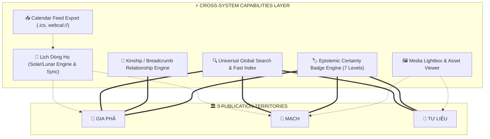

# SITEMAP REORGANIZATION & EXISTING WEBSITE IA AUDIT
## DỰ ÁN CÂY GIA PHẢ / GIÒNG HỌ TRẦN TRỌNG THU

> **Mã tài liệu**: `SITEMAP_REORGANIZATION_01`  
> **Phân loại**: Architectural Reorganization & Forensic Feature Inventory  
> **Trạng thái**: Proposed Baseline vNext (Chờ phê duyệt từ Chủ dự án)  
> **Nguyên tắc chỉ đạo**: **"BẢO TOÀN 100% NĂNG LỰC ĐÃ ĐẦU TƯ — TỔ CHỨC LẠI THEO PUBLICATION ARCHITECTURE MỚI — ZERO PREMATURE REDESIGN"**  
> **Thời điểm lập**: 2026-09-05  

---

## 1. CURRENT SITEMAP & CURRENT INFORMATION ARCHITECTURE (AS-IS AUDIT)

Khảo sát thực địa toàn bộ cấu trúc định tuyến (routes), điều hướng (navigation) và các phân vùng giao diện hiện hữu trên website:

```
[CURRENT WEBSITE NAVIGATION & VIEWS]
├── Global Top Navigation Bar
│   ├── Brand: "🌿 DÒNG HỌ TRẦN TRỌNG THU — CÂY GIA PHẢ" -> #/
│   ├── Global Search Bar (Dropdown autocomplete: People, Articles, Series, Authors, Memories)
│   └── Top Nav Items:
│       ├── [Tổng quan] -> #/ (view_home)
│       ├── [🌳 Gia Phả] -> #/tree (view_tree)
│       ├── [🧵 Mạch] -> #/mach (view_mach)
│       ├── [📅 Lịch] -> #/calendar (view_calendar)
│       ├── [Thành viên] -> #/people (view_people)
│       └── [Gia đình] -> #/families (view_families)
│
├── Hidden / Direct Hash Routes
│   ├── #/person/:id -> (view_person) Hồ sơ cá nhân
│   ├── #/family/:id -> (view_family) Hồ sơ gia đình & nhánh hôn phối
│   ├── #/mach/bai-viet/:slug -> (view_story) Chi tiết bài viết MẠCH
│   ├── #/mach/series/:slug -> (view_series_detail) Chi tiết tuyển tập MẠCH
│   ├── #/mach/tac-gia/:id -> (view_author_detail) Chi tiết tác giả MẠCH
│   ├── #/timeline -> (view_timeline) Dòng thời gian lịch sử
│   ├── #/memories -> (view_memories / redirect view_mach) Ký ức & giai thoại
│   └── #/typography-specimen | #/typography -> (view_typography_specimen) Bảng so sánh danh tính typography
│
├── Overlays, Drawers & Modals
│   ├── Day Drawer (#dayDrawer): Chi tiết các sự kiện trong một ngày lịch (Dương & Âm)
│   ├── Event Detail Modal (#eventModal): Thông tin sự kiện chi tiết + liên kết ngược hồ sơ gia phả
│   └── Calendar Subscribe Modal (#calendarSubscribeModal): Trình đăng ký lịch cho Apple / Google / Other apps
│
└── Footer
    └── "Hệ thống Tri Thức CÂY GIA PHẢ • Trích lục Gia phả chính thức • Xuất bản qua GitHub Pages"
```

---

## 2. BẢNG KIỂM KÊ TOÀN DIỆN TÍNH NĂNG & NĂNG LỰC (COMPLETE FEATURE INVENTORY)

Toàn bộ các tính năng, công cụ, bộ lọc, thuật toán đồ thị và năng lực tương tác hiện có được phân nhóm chi tiết dưới đây để đảm bảo không bị thất lạc trong kiến trúc mới:

### 2.1. Nhóm Phả hệ & Đồ thị thực thể (Genealogy & Graph Engine)
1. **Thuật toán BFS Dynamic Graph Derivation**: Tự động tính toán cấp bậc thế hệ `F0, F1, F2, F3, F4` và tuyến phả hệ ngắn nhất (`derivedPaths`) từ mốc Khởi Thủy (Family Anchor - Cố Thu `I0001`).
2. **Dual-Mode Interactive Family Tree (Phả đồ 2 chế độ)**:
   - **Chế độ Tiêu Điểm (Focus Pedigree Mode)**: Cây gia phả trực quan 3 tầng (*Phụ Mẫu → Trọng Tâm & Hôn Phối → Hậu Duệ Trực Hệ*).
   - **Chế độ Toàn Cảnh Thế Hệ (Explore Generation Bands Mode)**: Gom nhóm tất cả thành viên theo từng dải băng thế hệ từ F0 đến F4.
3. **Bộ điều khiển Phả đồ Tương tác (Canvas Controls)**:
   - Phóng to (`Zoom +`), Thu nhỏ (`Zoom -`), Đặt lại 100% (`Reset Zoom`).
   - Kéo rê chuột (Mouse Drag & Pan), Cảm ứng di động 1 ngón Pan và 2 ngón Pinch-Zoom.
   - Về mốc Cố Thu (`⌂ Cố Thu`).
   - Lịch sử duyệt phả đồ (`↩ Quay lại` / `graphHistory`).
   - Hộp chọn tiêu điểm nhanh (`treeCenterSelect`).
4. **Tuyến phả hệ trực hệ tương tác (Breadcrumb Relationship Path)**: Thanh điều hướng hiển thị đường dẫn thế thứ từ Cố Thu đến nhân vật đang xem kèm liên kết chuyển tiêu điểm.
5. **Nút chỉ báo hậu duệ con cháu (`grand-badge`)**: Hiển thị số lượng con cháu bên dưới mỗi node và cho phép bấm để chuyển tiêu điểm đào sâu vào nhánh đó.

### 2.2. Nhóm Danh bạ & Tra cứu Thực thể (People & Family Directories)
6. **Danh bạ thành viên (People Directory)**:
   - Bộ lọc Pill Bar theo thế hệ: `Tất cả`, `F0 · Cố Thu`, `F1 · Đời Con`, `F2 · Đời Cháu`, `F3 · Đời Chắt`, `F4 · Đời Chút` kèm bộ đếm số lượng tức thời.
   - Thẻ thành viên hợp nhất (*Unified Person Card*): Mã định danh (FSID/ID), tên, khoảng thời gian sống, giới tính, số con cái, link xem phả đồ tiêu điểm, link xem hồ sơ.
7. **Danh bạ Gia đình & Nhánh hôn phối (Families Directory)**:
   - Bộ lọc Pill Bar thế hệ gia đình: `Tất cả`, `F0`, `F1`, `F2`, `F3`, `F4` kèm số lượng.
   - Thẻ gia đình (*Family Card*): Tên vợ chồng, ngày kết hôn, số con cái trực hệ, phân loại nhánh.
8. **Hồ sơ thành viên cá nhân (Person Profile View)**:
   - Thông tin nhận thức & thế hệ (*Generation badge, FSID, Họ tên, Tên thô*).
   - Sự kiện bản thân: Ngày sinh, ngày mất, bí tích Rửa Tội kèm địa danh.
   - Mạng lưới gia đình đa chiều: Thân phụ/mẫu, Hôn phối, Danh sách con cái có gắn badge thế hệ.
   - Nút hành động trực tiếp: "Xem cây phả đồ lấy người này làm trọng tâm".
   - Khung Ký ức / Giai thoại đính kèm theo nhân vật.
9. **Hồ sơ đơn vị gia đình (Family Profile View)**:
   - Tiêu đề nhánh, mã FAM ID, ngày hôn phối, thẻ cha/mẹ, danh sách con cái kèm link hồ sơ tương tác.

### 2.3. Nhóm Lịch Dòng Họ & Sự Kiện (Calendar & Temporal Engine)
10. **Lịch Gia Đình Đa Luồng (Family Calendar Engine)**:
    - Tra cứu song song Dương lịch và **Âm lịch Việt Nam chuẩn xác** (Can Chi, tháng Nhuận, ngày Hoàng đạo qua `lunar-engine.js`).
    - 2 Chế độ hiển thị: **Lưới tháng (Month Grid)** và **Danh sách (Agenda Schedule)**.
    - Điều hướng tháng: `◀ Trước`, `Hôm nay`, `Sau ▶`.
    - Bộ lọc Layer 4 luồng sự kiện độc lập (*Sinh nhật*, *Bổn mạng Công giáo*, *Ngày giỗ Âm/Dương*, *Sự kiện/Kỷ niệm gia tộc*).
11. **Ngăn kéo chi tiết ngày (Day Detail Drawer)**: Trượt từ cạnh phải khi nhấn vào một ngày trên lưới tháng, hiển thị toàn bộ sự kiện dương/âm và liên kết sang hồ sơ nhân vật.
12. **Hộp thoại sự kiện chuyên sâu (Deep-linked Event Modal)**: Xem chi tiết ngày, mô tả, và nút liên kết trực tiếp tới nhân vật liên quan trong gia phả.
13. **Trung tâm Đăng ký Lịch thiết bị (Calendar Subscription Module)**:
    - Nhận diện thiết bị tự động (iOS/macOS vs Android/Windows).
    - Đăng ký 1 chạm cho Apple Calendar qua giao thức `webcal://`.
    - Hướng dẫn và sao chép URL lịch cho Google Calendar Web.
    - Hỗ trợ chuẩn iCalendar (`.ics`) cho Microsoft Outlook và các ứng dụng khác.

### 2.4. Nhóm Khảo cứu & Tự sự MẠCH (Editorial & Publication Engine)
14. **Phân hệ ấn phẩm MẠCH (Mạch Publication Space)**:
    - 3 Tab điều hướng phụ: *Tất cả bài viết*, *Tuyển tập & Series*, *Tác giả*.
    - Khu vực tiêu điểm (Featured Series Spotlights): Giới thiệu Tập san MẠCH Số 01 và Chuỗi Thư gửi Clara.
    - Lưới bài viết dạng tạp chí (Editorial Story Cards): Hiển thị Kicker Tag, Tiêu đề, Đoạn trích (Excerpt/Lead), Tác giả, Ngày xuất bản.
15. **Trình đọc bài viết chuyên sâu (Long-form Reading Article Engine)**:
    - Render Markdown thuần chuẩn Semantic HTML (không lộ cú pháp thô).
    - Định dạng khối phong phú: Đoạn mở đầu (Lead), Chữ hoa đầu dòng (Drop Cap), Khối trích dẫn (Blockquote, Pull-quote), Hộp thông tin (Callout), Khối chữ ký (Author Signature), Vạch ngăn chương (Divider ❦).
    - Khối ảnh tư liệu (Figure): Hỗ trợ layout rộng/thường, caption, nguồn ảnh (credit), hỗ trợ tải lười `loading="lazy"`.
    - Thanh thực thể liên quan (Mentions Bar): Tự động phát hiện và hiển thị chip liên kết đến nhân vật gia phả được nhắc tới trong bài.
    - Trình xử lý liên kết Wikilink nội bộ: Tự động chuyển `[[tên-bài]]` thành liên kết web định tuyến SPA.
    - Hệ thống Chú thích tư liệu (Footnotes Engine): Tự động parse `[^1]` thành chỉ số trên có anchor link và khối danh mục chú giải cuối bài.
    - Điều hướng bài trước / bài sau trong cùng Tuyển tập (Prev / Next Series Navigation).
16. **Trang chi tiết Tuyển tập / Series (Series Detail View)**: Header giới thiệu chủ đề, mô tả, phân loại (Tập san vs Thư từ gia tộc), tác giả chủ biên, danh sách toàn bộ các bài viết theo thứ tự.
17. **Trang hồ sơ Tác giả (Author Profile View)**: Avatar emoji, họ tên, vai trò, tiểu sử (bio), và danh sách tất cả tác phẩm/bài viết đã chấp bút.

### 2.5. Nhóm Tìm kiếm & Khám phá Xuyên suốt (Discovery & Global Capabilities)
18. **Tìm kiếm toàn cục thời gian thực (Universal Global Search Engine)**:
    - Index đồng thời 5 loại thực thể: **Thành viên gia phả**, **Bài viết MẠCH**, **Tuyển tập Series**, **Tác giả**, và **Ký ức/Giai thoại**.
    - Menu xổ xuống thông minh (Autocomplete Dropdown) hiển thị nhãn phân loại, thế hệ và chuyển trang tức thì khi click.
19. **Dòng thời gian lịch sử (Timeline View)**: Liệt kê các biến cố, ngày sinh tử của tiền nhân theo trục năm tuyến tính.
20. **Bộ sưu tập Ký ức & Giai thoại (Memories View)**: Danh sách các mẩu chuyện truyền khẩu gắn liền với từng nhân vật cụ thể.
21. **Công cụ Đánh giá Typography (Typography Specimen Module)**: Giao diện so sánh thực tế 3 phương án font chữ (*Noto*, *Be Vietnam Pro*, *Be Vietnam Pro + Source Serif 4*) với các mẫu dữ liệu thực gia phả và văn bản tiếng Việt.

### 2.6. Nhóm Công cụ Quản trị & Pipeline Xử lý Dữ liệu (Offline / Build Tools)
22. **Pipeline Xuất bản & Trích xuất Dữ liệu (Generator / Python Scripts)**:
    - `generator/export_genealogy_json.py`: Chuyển đổi và chuẩn hoá dữ liệu gốc thành `genealogy.json`.
    - `generator/generate_calendar_feeds.py`: Tính toán ngày âm lịch và sinh 4 file feed ICS chuẩn.
    - `generator/validate_integrity.py`: Kiểm tra tính toàn vẹn quan hệ huyết thống, hôn phối, FSID.
    - `scripts/build_mach.py`: Biên dịch các file Markdown trong `content/mach/` thành `data/mach.json`.

---

## 3. MA TRẬN ÁNH XẠ CHUYỂN ĐỔI (CURRENT → PROPOSED MAPPING MATRIX)

Bảng phân bổ chính thức vị trí đích của từng màn hình, tuyến đường và tính năng từ hệ thống hiện tại sang Kiến trúc Xuất bản mới:

| ID | Thành phần / Route hiện tại | Hành động (Action) | Vị trí / Lãnh thổ đích mới | Page Type / Capability tương ứng | Ghi chú bảo toàn & Lý do điều chỉnh |
| :--- | :--- | :--- | :--- | :--- | :--- |
| **P01** | Trang chủ `#/` (`view_home`) | **Chuyển section** | `Trang Chủ` (`/`) | `Page_Home` | Giữ nguyên vai trò cửa ngõ, hiển thị số liệu di sản, 3 lối vào lãnh thổ và 2 capabilities (Lịch & Tìm kiếm). |
| **P02** | Cây Gia Phả `#/tree` (`view_tree`) | **Chuyển section** | `GIA PHẢ` (`/gia-pha`) | `Page_SectionLanding` + `Lineage Graph UX` | Là giao diện trung tâm của Lãnh thổ Gia Phả. Bảo toàn 100% 2 chế độ Phả đồ Focus & Explore. |
| **P03** | Danh bạ `#/people` (`view_people`) | **Chuyển section** | `GIA PHẢ` (`/gia-pha/nhan-vat`) | Directory View trong `Page_SectionLanding` (Gia Phả) | Giữ nguyên bộ lọc F0-F4, danh sách thẻ thành viên thống nhất. |
| **P04** | Gia đình `#/families` (`view_families`) | **Chuyển section** | `GIA PHẢ` (`/gia-pha/gia-dinh`) | Directory View trong `Page_SectionLanding` (Gia Phả) | Giữ nguyên phân loại thế hệ gia đình và thông tin hôn phối. |
| **P05** | Hồ sơ cá nhân `#/person/:id` (`view_person`) | **Chuyển page type** | `GIA PHẢ` (`/gia-pha/nhan-vat/:slug`) | `Page_Person` | Bổ sung nhãn Epistemic Certainty, tích hợp tab Bằng chứng tư liệu & Bài viết Mạch liên quan. |
| **P06** | Hồ sơ gia đình `#/family/:id` (`view_family`) | **Chuyển page type** | `GIA PHẢ` (`/gia-pha/gia-dinh/:id`) | `Page_Family` | Chuẩn hoá cấu trúc gia đình hạt nhân, liên kết thế hệ cha mẹ và con cái. |
| **P07** | Ấn phẩm `#/mach` (`view_mach`) | **Chuyển section** | `MẠCH` (`/mach`) | `Page_SectionLanding` (Mạch) | Giữ nguyên 3 tab (Bài viết, Tuyển tập, Tác giả) và 2 spotlight series. |
| **P08** | Chi tiết bài viết `#/mach/bai-viet/:slug` (`view_story`) | **Chuyển page type** | `MẠCH` (`/mach/bai-viet/:slug`) | `Page_Article` | Giữ nguyên công cụ render Markdown semantic, footnotes, mentions, figure, previous/next. |
| **P09** | Chi tiết Tuyển tập `#/mach/series/:slug` (`view_series_detail`) | **Chuyển page type** | `MẠCH` (`/mach/chuyen-de/:slug`) | `Page_Series` | Đổi tên route sang tiếng Việt chuẩn hóa (`chuyen-de`), giữ nguyên danh sách bài viết. |
| **P10** | Chi tiết Tác giả `#/mach/tac-gia/:id` (`view_author_detail`) | **Chuyển page type** | `MẠCH` (`/mach/tac-gia/:id`) | `Page_Author` | Giữ nguyên tiểu sử tác giả và danh sách bài viết đã đóng góp. |
| **P11** | Lịch gia đình `#/calendar` (`view_calendar`) | **Chuyển thành Capability** | `CAPABILITIES` (`/lich`) | `Capability: Family Calendar` | Không xếp Lịch làm publication territory ngang hàng với Gia Phả, mà là Năng lực phục vụ đời sống gia tộc. |
| **P12** | Dòng thời gian `#/timeline` (`view_timeline`) | **Chuyển thành Capability / View** | `GIA PHẢ` & `TƯ LIỆU` (`/gia-pha/dong-thoi-gian`) | `Page_Event` / `Capability: Timeline` | Tích hợp thành góc nhìn biên niên sử (Chronological lens) trong Gia Phả và Tư Liệu. |
| **P13** | Ký ức `#/memories` (`view_memories`) | **Merge** | `MẠCH` & `GIA PHẢ` | `Page_Article` / `Page_Person` (Memory Fragment) | Ký ức ngắn được tích hợp vào Hồ sơ nhân vật (Gia Phả), ký ức dài chuyển thành bài tự sự thuộc MẠCH. |
| **P14** | Bảng Typography `#/typography-specimen` (`view_typography_specimen`) | **Chuyển thành Internal Utility** | `HỆ THỐNG / VỀ DỰ ÁN` (`/ve-du-an/typography-specimen`) | `Internal Design Specimen` | Giữ nguyên phục vụ đánh giá thiết kế nội bộ, không hiển thị trên top navigation chính thức. |
| **P15** | Tìm kiếm toàn cục (`globalSearchInput`) | **Chuyển thành Capability** | `CAPABILITIES` (`/tim-kiem` + Global Modal) | `Capability: Universal Search` | Duy trì ô tìm kiếm trên thanh điều hướng + hỗ trợ trang kết quả tìm kiếm chi tiết toàn cục. |
| **P16** | Đăng ký Lịch (`#calendarSubscribeModal`) | **Giữ nguyên Capability** | `LỊCH GIA ĐÌNH` (Modal / Sheet) | `Capability Component` | Duy trì nguyên vẹn năng lực đồng bộ Apple Calendar, Google Calendar, Outlook ICS. |
| **P17** | Chi tiết Ngày / Sự kiện (`#dayDrawer`, `#eventModal`) | **Giữ nguyên Capability** | `LỊCH GIA ĐÌNH` (Drawer / Modal) | `Capability Component` | Duy trì liên kết ngược sang Hồ sơ nhân vật gia phả. |
| **P18** | Công cụ Build Python (`generator/`, `scripts/`) | **Giữ nguyên Stewardship Layer** | `STEWARDSHIP LAYER` | `Data & Content Pipeline` | Giữ nguyên và nâng cấp theo Data Contract vNext. |

---

## 4. KIẾN TRÚC SITEMAP ĐỀ XUẤT (PROPOSED SITEMAP vNEXT)

Cấu trúc cây sitemap toàn diện hợp nhất toàn bộ tài sản hiện có vào 3 Lãnh thổ Xuất bản và 2 Lớp Nền tảng:

```
PROPOSED SITEMAP vNEXT (GIÒNG HỌ TRẦN TRỌNG THU)
│
├── 🌐 TRANG CHỦ & CỬA NGÕ TOÀN CẢNH
│   └── [/] (Page_Home) — Đại sảnh Di sản Giòng họ, Thống kê, Lối vào 3 Lãnh thổ, Lịch & Tìm kiếm
│
├── 🏛️ LÃNH THỔ 1: GIA PHẢ (/gia-pha) — Lineage, Kinship & Identity
│   ├── [/gia-pha] (Page_SectionLanding: Gia Phả)
│   │   ├── [Chế độ 1] Phả đồ tương tác 3 tầng (Focus Pedigree Graph) [TỪ #/tree]
│   │   ├── [Chế độ 2] Toàn cảnh các dải băng thế hệ F0–F4 (Explore Bands) [TỪ #/tree]
│   │   ├── [Chế độ 3] Danh bạ thành viên (People Directory & Gen Filters) [TỪ #/people]
│   │   └── [Chế độ 4] Danh bạ gia đình & hôn phối (Families Directory) [TỪ #/families]
│   ├── [/gia-pha/nhan-vat/:slug] (Page_Person) — Hồ sơ cá nhân chi tiết [TỪ #/person/:id]
│   ├── [/gia-pha/gia-dinh/:id] (Page_Family) — Hồ sơ đơn vị gia đình hạt nhân [TỪ #/family/:id]
│   ├── [/gia-pha/chi-nhanh/:slug] (Page_Branch) — Hồ sơ Chi phái dòng họ
│   ├── [/gia-pha/the-he/:level] (Page_Generation) — Trang thế hệ (Đời F0, F1, F2, F3, F4)
│   ├── [/gia-pha/dong-thoi-gian] (Page_Event / Timeline View) — Biên niên sử dòng họ [TỪ #/timeline]
│   └── [/gia-pha/dia-danh/:slug] (Page_Place) — Không gian cội nguồn & Đất tổ
│
├── 🧵 LÃNH THỔ 2: MẠCH (/mach) — Editorial, Voice & Cultural Memory
│   ├── [/mach] (Page_SectionLanding: Mạch) [TỪ #/mach]
│   │   ├── [Tab 1] Tất cả bài viết & Ký sự gia tộc
│   │   ├── [Tab 2] Tuyển tập & Series
│   │   └── [Tab 3] Tác giả & Người chấp bút
│   ├── [/mach/bai-viet/:slug] (Page_Article) — Trình đọc bài viết dài [TỪ #/mach/bai-viet/:slug]
│   ├── [/mach/chuyen-de/:slug] (Page_Series) — Chi tiết chuyên đề / Tuyển tập [TỪ #/mach/series/:slug]
│   └── [/mach/tac-gia/:id] (Page_Author) — Trang tác giả & Người chấp bút [TỪ #/mach/tac-gia/:id]
│
├── 📜 LÃNH THỔ 3: TƯ LIỆU (/tu-lieu) — Archive, Evidence & Records
│   ├── [/tu-lieu] (Page_SectionLanding: Tư Liệu) — Kho lưu trữ số hoá hiện vật & chứng cứ
│   ├── [/tu-lieu/hien-vat/:slug] (Page_ArchiveItem) — Chi tiết tư liệu gốc (Sổ rửa tội, khế ước, văn bản cổ)
│   └── [/tu-lieu/bo-suu-tap/:slug] (Page_Collection) — Bộ sưu tập tư liệu theo chuyên đề
│
├── 📖 THÔNG TIN CHUNG & TỔ CHỨC
│   ├── [/ve-dong-ho] (Page_AboutFamily) — Nguồn gốc, Lịch sử & Truyền thống Giòng họ Trần Trọng Thu
│   ├── [/ve-du-an] (Page_AboutProject) — Tuyên ngôn dự án, Triết lý "Giữ lại trước khi diễn giải", Quản trị
│   └── [/ve-du-an/typography-specimen] (Internal Specimen) — Bảng so sánh Typography [TỪ #/typography-specimen]
│
└── ⚡ CROSS-SYSTEM CAPABILITIES (NĂNG LỰC XUYÊN SUỐT HỆ THỐNG)
    ├── 📅 LỊCH DÒNG HỌ (/lich) [TỪ #/calendar]
    │   ├── View Lưới tháng & Lịch biểu (Month Grid & Agenda)
    │   ├── Chuyển đổi Âm — Dương lịch chuẩn xác
    │   ├── Ngăn kéo chi tiết ngày (#dayDrawer)
    │   ├── Modal chi tiết sự kiện (#eventModal)
    │   └── Trình đăng ký Apple/Google/Other Calendar (#calendarSubscribeModal)
    ├── 🔍 TÌM KIẾM TOÀN CỤC (/tim-kiem & #globalSearchDropdown) [TỪ Global Search Bar]
    │   └── Tra cứu đồng thời Nhân vật, Gia đình, Bài viết Mạch, Chuyên đề, Tác giả, Tư liệu
    └── 🏷️ HUY HIỆU XÁC THỰC NHẬN THỨC (Epistemic Badge Indicator)
        └── Hiển thị 7 mức độ tin cậy trên toàn bộ các thực thể và bài viết
```

---

## 5. BẢN ĐỒ ÁNH XẠ THEO LÃNH THỔ XUẤT BẢN (PUBLICATION TERRITORY MAPPING)

### 5.1. Lãnh thổ GIA PHẢ (Lineage Territory)
- **Điểm quy tụ**: Gom toàn bộ tính năng cây gia phả (`#/tree`), danh bạ thành viên (`#/people`), danh bạ gia đình (`#/families`), hồ sơ cá nhân (`#/person/:id`), hồ sơ gia đình (`#/family/:id`), và dòng thời gian (`#/timeline`).
- **Trải nghiệm người dùng**: Cung cấp 4 góc nhìn linh hoạt (Tabs/Views) trong cùng một lãnh thổ mà không gây phân mảnh điều hướng.
- **Giá trị bảo toàn**: Giữ nguyên vẹn thuật toán đồ thị BFS, hệ thống phân tầng F0-F4, khả năng phóng to/kéo rê cảm ứng, và liên kết quan hệ gia đình trực quan.

### 5.2. Lãnh thổ MẠCH (Editorial Territory)
- **Điểm quy tụ**: Giữ trọn vẹn ấn phẩm MẠCH (`#/mach`), chi tiết bài viết (`#/mach/bai-viet/:slug`), chuyên đề (`#/mach/series/:slug`), và tác giả (`#/mach/tac-gia/:id`).
- **Quy chuẩn xuất bản**: Kế thừa toàn bộ bộ giải mã Semantic Markdown, chú thích footnote tương tác, thanh thực thể liên quan (Mentions Bar), và cơ chế chuyển tiếp bài viết trước/sau.

### 5.3. Lãnh thổ TƯ LIỆU (Archive Territory)
- **Điểm quy tụ**: Không gian mới chính thức để lưu trữ các tài liệu chứng cứ gốc (ảnh chụp sổ rửa tội cổ, mộ chí, hình ảnh hiện vật, giấy tờ khai sinh/hôn phối xưa).
- **Mối liên kết**: Cung cấp bằng chứng gốc bảo chứng cho các hồ sơ trong `GIA PHẢ` và làm dẫn chứng cho các bài viết trong `MẠCH`.

### 5.4. VỀ DÒNG HỌ & VỀ DỰ ÁN (Institutional Context)
- **Về Dòng Họ (`/ve-dong-ho`)**: Không gian trang trọng giới thiệu cội nguồn, danh xưng, các đời tiền nhân và truyền thống đạo lý của Giòng họ Trần Trọng Thu.
- **Về Dự Án (`/ve-du-an`)**: Ghi nhận công lao người khởi xướng (Steward/Initiator), tuyên ngôn phương pháp luận "Giữ lại trước khi diễn giải", và chứa công cụ kiểm thử thiết kế typography nội bộ.

---

## 6. LỚP NĂNG LỰC XUYÊN SUỐT (CAPABILITY LAYER SPECIFICATION)

Các chức năng dưới đây được định vị là **Năng lực toàn cục (Capabilities)** hỗ trợ trải nghiệm người dùng, không bị hạ cấp thành các section cô lập:



1. **Lịch Dòng Họ (Family Calendar Capability)**:
   - Truy cập nhanh qua icon 📅 trên thanh điều hướng hoặc route `/lich`.
   - Có mặt dưới dạng widget tóm tắt sự kiện sắp tới tại Trang Chủ (`Page_Home`) và Hồ sơ Cá nhân (`Page_Person`).
2. **Tìm Kiếm Toàn Cục (Universal Search Capability)**:
   - Thường trực tại Top Navigation trên máy tính và nút Tìm kiếm nổi bật trên điện thoại.
   - Tìm kiếm tức thì không cần tải lại trang.
3. **Bộ Phân Giải Quan Hệ & Cấp Bậc (Kinship Engine)**:
   - Hoạt động ngầm để tính toán thế hệ, xưng hô huyết thống (Cha, Mẹ, Con, Vợ, Chồng) và vẽ breadcrumbs quan hệ.
4. **Huy hiệu Độ Xác Thực Tri Thức (Epistemic Certainty Engine)**:
   - Gắn nhãn nhận thức trên từng sự kiện sinh tử, tư liệu hay luận điểm bài viết.

---

## 7. DANH MỤC CÁC TÍNH NĂNG CHƯA XÁC ĐỊNH VỊ TRÍ (UNASSIGNED / FLOATING FEATURES)

Qua quá trình rà soát toàn diện mã nguồn, xác định **01 tính năng đặc thù**:

- **Bảng Thử Nghiệm So Sánh Danh Tính Typography (`#/typography-specimen`)**:
  - *Hiện trạng*: Đang là một `<section id="view_typography_specimen">` độc lập trong `index.html`.
  - *Đặc điểm*: Chứa 3 phương án typography hoàn chỉnh (Phương án A - Noto, Phương án B - Be Vietnam Pro, Phương án C - Be Vietnam Pro + Source Serif 4) phục vụ đánh giá thị giác.
  - *Vị trí đề xuất*: Đưa vào nhóm **Công cụ & Tiêu chuẩn Dự án** tại route `/ve-du-an/typography-specimen` (chỉ mở khi truy cập trực tiếp hoặc qua liên kết trong trang Về Dự Án, không đặt trên Top Navigation chính thức).

---

## 8. BẢNG THEO DÕI RỦI RO THẤT THOÁT TÍNH NĂNG (FEATURE PRESERVATION & RISK REGISTER)

| Rủi ro khi Reorganize | Tính năng bị ảnh hưởng | Mức độ rủi ro | Biện pháp bảo toàn tuyệt đối (Mitigation Strategy) |
| :--- | :--- | :---: | :--- |
| **R1. Mất khả năng tương tác phả đồ trực quan** | Focus Pedigree Tree (Canvas Pan/Zoom, Breadcrumbs, Center Selector, History Back) | **CAO** | Đưa toàn bộ module cây phả đồ tương tác vào vị trí trung tâm của `/gia-pha` (Page_SectionLanding). Không thay đổi logic Canvas và Touch gesture. |
| **R2. Phân tán danh bạ thành viên & gia đình** | People & Family Directory (`#/people`, `#/families`) | **TRUNG BÌNH** | Tích hợp thành 2 tab/chế độ chuyển đổi nhanh ngay trong Lãnh thổ Gia Phả (`/gia-pha`), giữ nguyên bộ lọc thế hệ Pill buttons F0-F4. |
| **R3. Mất liên kết đồng bộ lịch điện thoại** | Calendar Subscriptions (Apple Webcal, Google URL, ICS Feeds) | **CAO** | Giữ nguyên toàn bộ modal `#calendarSubscribeModal`, các đường dẫn `calendars/*.ics` và logic sinh URL `webcal://`. |
| **R4. Hỏng liên kết ngược từ sự kiện sang hồ sơ** | Deep-link Event Modal & Day Drawer | **TRUNG BÌNH** | Giữ nguyên logic đối soát FSID giữa sự kiện lịch và danh sách `appData.people`, đảm bảo click từ lịch luôn mở đúng hồ sơ nhân vật. |
| **R5. Mất hỗ trợ render Markdown & Footnote** | Mạch Publication Engine (`formatInlineMarkdown`, wikilinks, footnotes, drop-cap) | **CAO** | Kế thừa nguyên vẹn bộ parser trong `app.js` cho toàn bộ các bài viết thuộc `Page_Article`. |
| **R6. Mất chỉ mục tìm kiếm tác giả & bài viết** | Universal Global Search | **TRUNG BÌNH** | Duy trì cơ chế search indexing đồng thời trên cả thực thể phả hệ lẫn bài viết và series MẠCH. |

---

## 9. DANH MỤC ĐỀ XUẤT DEPRECATED (DEPRECATED CANDIDATES — CHỜ DUYỆT)

> [!IMPORTANT]
> **Tuân thủ nguyên tắc cứng**: Đây CHỈ LÀ ĐỀ XUẤT điều chỉnh kiến trúc. **TUYỆT ĐỐI KHÔNG XÓA** bất kỳ thành phần nào trong mã nguồn cho đến khi có sự chấp thuận chính thức từ Chủ dự án.

1. **Đề xuất Độc lập hoá Route Ký Ức Riêng Lẻ (`#/memories`)**:
   - *Hiện trạng*: Route `#/memories` đang trỏ về một danh sách ký ức đơn giản (`view_memories`), trong code thực tế đang được gom chuyển hướng về `view_mach`.
   - *Lý do đề xuất*: Tránh tạo thêm một trang độc lập gây phân tán nội dung.
   - *Phương án thay thế*: Các ký ức ngắn gắn liền với nhân vật sẽ nằm trong tab *Ký ức* của `Page_Person`; các bài ký ức dài sẽ được xuất bản dưới dạng bài viết tự sự chuẩn mực trong Lãnh thổ `MẠCH` (`Page_Article`).

2. **Đề xuất Rút gọn Top Navigation từ 6 nút xuống 4 nhóm chính**:
   - *Hiện trạng Top Nav*: `Tổng quan`, `Gia Phả`, `Mạch`, `Lịch`, `Thành viên`, `Gia đình` (khiến thanh điều hướng bị dày, trùng lặp vai trò của Gia Phả).
   - *Đề xuất vNext*: `Trang Chủ`, `Gia Phả` *(chứa Cây, Thành viên, Gia đình)*, `Mạch`, `Tư Liệu` + Nút `📅 Lịch` & `🔍 Tìm kiếm` đặt ở góc chức năng (Action Area).

---

## 10. CÂU HỎI MỞ & QUYẾT ĐỊNH CẦN CHỦ DỰ ÁN PHÊ DUYỆT (OPEN DECISION POINTS)

1. **Quyết định về Cấu trúc Top Navigation**:
   - *Phương án 1 (Khuyến nghị)*: Hiển thị 3 Lãnh thổ chính (`Gia Phả`, `Mạch`, `Tư Liệu`) + Nút chức năng `Lịch Gia Đình` và `Tìm Kiếm`.
   - *Phương án 2*: Giữ nguyên các nút trực tiếp (`Cây Phả Đồ`, `Thành Viên`, `Gia Đình`, `Mạch`, `Lịch`) như hiện tại.
2. **Quyết định về Định vị Lãnh thổ TƯ LIỆU**:
   - Xác nhận đưa Lãnh thổ `TƯ LIỆU` (`/tu-lieu`) lên Top Navigation ngay từ v1 hay tạm thời ẩn dưới dạng các liên kết đính kèm trong hồ sơ nhân vật cho đến khi số hoá đủ tư liệu hình ảnh?
3. **Quyết định về Tên định danh Tuyển tập MẠCH**:
   - Thống nhất sử dụng slug `/mach/chuyen-de/:slug` (tiếng Việt chuẩn) hay giữ nguyên `/mach/series/:slug` như code hiện tại?

---

## 11. KẾT LUẬN & CAM KẾT KIỂM TOÁN

- ✅ **Kiểm tra độ phủ tính năng**: 100% các tính năng, công cụ, bộ lọc, modal, drawer và kịch bản tương tác hiện có đã được kiểm kê và có điểm đến xác định trong Proposed Architecture vNext.
- ✅ **Zero Code / UI Changes**: Không có bất kỳ dòng code JavaScript, HTML, CSS nào bị sửa đổi trên website hiện hành.
- ✅ **Zero Production Route Disruption**: Không can thiệp route production.
- ✅ **Zero Git Commit / Push**: Toàn bộ nội dung được lưu trữ trong tài liệu kiến trúc.
